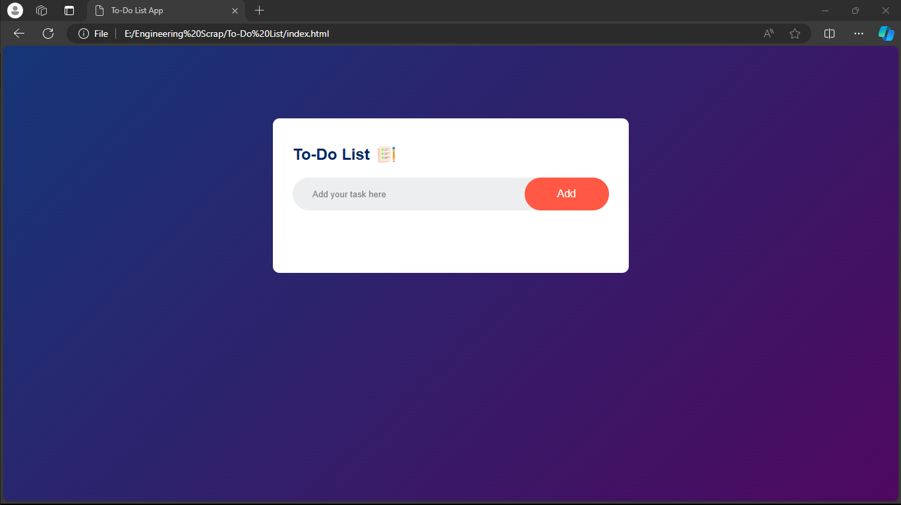

# TO DO List App

This project is a simple and interactive TO DO List application built using HTML, CSS, and JavaScript. It allows users to add, delete, and mark tasks as complete, providing a streamlined way to manage daily tasks.

## Features

- **Add Tasks**: Users can add new tasks to their list.
- **Delete Tasks**: Users can remove tasks from their list.
- **Mark as Complete**: Users can mark tasks as complete, with visual indication.
- **Responsive Design**: The app is designed to work on various screen sizes.

## Getting Started

To get a local copy up and running follow these simple steps.

### Prerequisites

You need a web browser to run this application. No additional software or libraries are required.

### Installation

1. Clone the repo
   ```sh
   git clone https://github.com/ashutoshh-17/To-Do-List
   ```
2. Navigate to the project directory
   ```sh
   cd todo-list-app
   ```

### Usage

Open `index.html` in your web browser to start using the app.

## Files

- `index.html`: The main HTML file containing the structure of the app.
- `style.css`: The CSS file for styling the app.
- `script.js`: The JavaScript file containing the functionality of the app.

## Code Overview

### HTML

The HTML file includes the structure of the app, including the input field for new tasks and the list where tasks will be displayed.

### CSS

The CSS file is responsible for the visual styling of the app, making it look clean and modern.

### JavaScript

The JavaScript file handles all the interactive aspects of the app, including adding, deleting, and marking tasks as complete.

#### Key Functions

- `addTask()`: Adds a new task to the list.
- `deleteTask(taskId)`: Deletes a task from the list.
- `toggleComplete(taskId)`: Marks a task as complete or incomplete.

## Screenshots

### Main Interface



### Adding a Task


### Task Added


### Marking a Task as Complete


## Contributing

Contributions are what make the open-source community such an amazing place to learn, inspire, and create. Any contributions you make are **greatly appreciated**.


## Acknowledgments

- [OpenAI](https://www.openai.com/) for providing the language model.
- [MDN Web Docs](https://developer.mozilla.org/) for web development resources.
- [W3Schools](https://www.w3schools.com/) for tutorials and references.

---

This README file provides an overview and setup instructions for the TO DO List App. If you have any questions or need further assistance, feel free to reach out. Happy coding!
